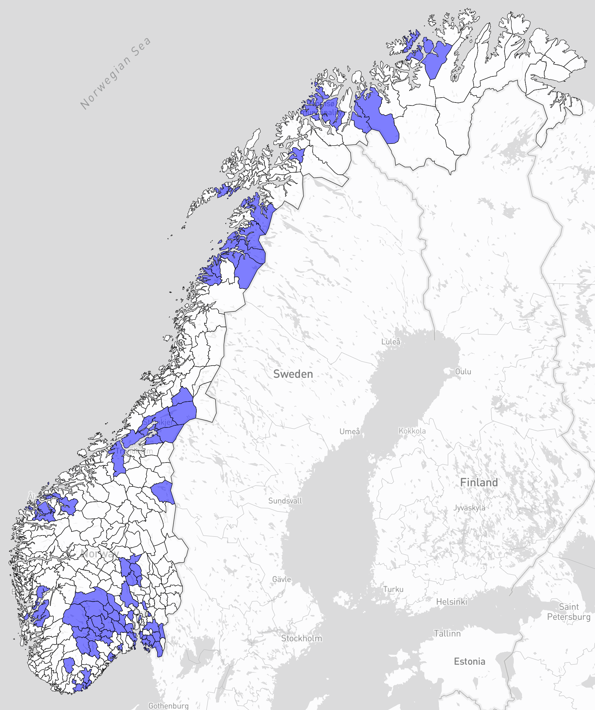

# Map of Norwegian Municipalities
This project is designed to filter and highlight certain municipalities in Norway. The source data is in GeoJSON format, and the output is also a GeoJSON file with additional properties to indicate whether a municipality should be highlighted.

<figure>
    
    <figcaption><em>Highlighted municipalities in blue. Map by Mapsharper.</em></figcaption>
</figure>

## Requirements
* Node.js
* npm

## Installation
Clone this repository.
Run `npm install` to install the dependencies.

## Usage
The main script in this project is `index.js`. This script reads a GeoJSON file and a CSV file with the names of municipalities to keep. It then iterates over the features in the GeoJSON file, and if a municipality is in the list to keep, it modifies its properties to indicate that it should be highlighted.

The `index.js` script reads from `Kommuner-S.geojson` and `kommuner-to-keep.csv`, and writes to `kommuner_output.geojson` and `matching_names.csv`.
The latter is used to list out which municipalities are highlighted after the filtering. 

To run the script, use the following command:
```bash
node index.js
```

`kommuner-to-keep.csv` is just a list of municipality names - each name on a separate line.

`Kommuner-S.geojson` can be found here: https://github.com/robhop/fylker-og-kommuner/blob/main/Kommuner-S.geojson

Make sure to have an updated GeoJSON file (kommunesammenslåing amirite)


## Output
The output GeoJSON file (`kommuner_output.geojson`) contains the same features as the input file, but with additional properties for the municipalities to keep:

```json
"stroke": "#000000"
"stroke-width": 0.5
"stroke-opacity": 1
"fill": "#0000ff"   <-- Blue highlight
"fill-opacity": 0.5
```

The municipalities that are not in the list to keep have the following properties:

```json
"stroke": "#000000"
"stroke-width": 0.5
"stroke-opacity": 1
"fill": "#ffffff"   <-- White
"fill-opacity": 0.5
```

The CSV file (`matching_names.csv`) contains the names of the municipalities that were found in the list to keep.

## Generating a map of the municipalities
Simply paste the generated GeoJSON data into [geojson.tools](geojson.tools), [geojson.io](geojson.io) or [mapshaper.org](https://mapshaper.org/).